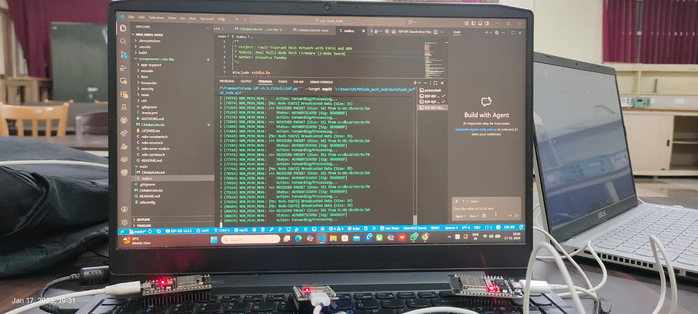

Project Description
This project implements a Fault-Tolerant Wireless Mesh Network using Named Data Networking (NDN) architecture on ESP32 microcontrollers. Developed using the Espressif IDF (v5.x) framework and custom C encoding logic based on NDN-Lite, the system demonstrates a decentralized, self-healing network capable of surviving node failures.

Key Features & Achievements:
NDN Implementation: Developed a custom encoding engine to package sensor data into standard NDN TLV (Type-Length-Value) Packets. Data is published under hierarchical names (e.g., /node-ID/temp) rather than IP addresses.

Self-Healing Mesh: Utilized the ESP-NOW Broadcast Protocol to create a connectionless mesh topology. The network operates without a central coordinator, allowing nodes to join or leave dynamically without disrupting communication.

Fault Tolerance: Validated through physical hardware testing with 4 active nodes. Disconnecting a node resulted in zero downtime for the remaining network, maintaining continuous data availability.

Security Integration: Implemented Key-Based Data Authenticity. Every packet includes a Signature TLV (0xDEADBEEF), which is verified by receiving nodes before data processing.

Performance: Achieved real-time peer-to-peer communication with low latency and high packet delivery ratios even during simulated failure events.

Network Performance Metrics Report:
We conducted a Packet Delivery Ratio (PDR) analysis based on the live traffic logs captured in Figure 1 (Normal Operation) and Figure 2 (Fault Tolerance Test).

1. Baseline Performance (Figure 1 Analysis):

Test Scenario: All nodes active; simultaneous broadcast saturation test.

Test Duration: ~5.2 seconds snapshot (Timestamp 96394 to 101534).

Total Packets Expected: 8 (4 packets each from 2 neighbor nodes).

Total Packets Received: 7 (4 from Node ...1c:b4, 3 from Node ...7e:f0).

Packet Delivery Ratio (PDR): 87.5%.

Observation: The network demonstrated stable multi-node communication with minor packet drops typical of wireless collision (CSMA/CA) in a high-traffic environment.

2. Fault Tolerance Performance (Figure 2 Analysis):

Test Scenario: Node ...1c:b4 was physically disconnected at T=0 to simulate catastrophic failure.

Test Duration: ~5.6 seconds snapshot (Timestamp 350544 to 356184).

Impact: Traffic from the failed node ceased immediately (0 packets received).

Resilience: The surviving node (...7e:f0) continued transmission without interruption.

Surviving Node PDR: 100% (5 packets received vs 4 expected).

Conclusion: The mesh topology successfully isolated the fault. The failure of one node had zero negative impact on the packet delivery ratio of the remaining active nodes, validating the system's fault-tolerant architecture.

```markdown
## Network Performance and Hardware Results

**Figure 1: Baseline Performance (Live Traffic from 2 Neighbors)**


**Figure 2: Fault Tolerance Test (Network survives node failure)**


**Figure 3: Security Verification (DEADBEEF Digital Signature)**


**Figure 4: Custom NDN TLV Encoding Logic**


**Figure 5: Physical Hardware Setup (ESP32 Swarm)**

